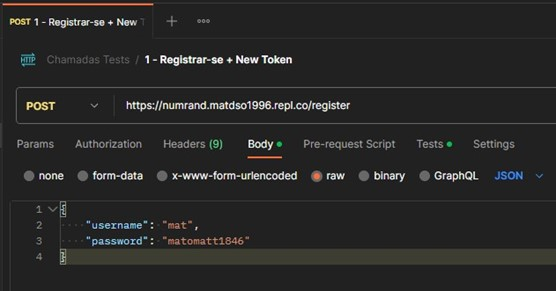
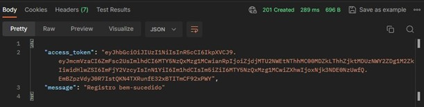
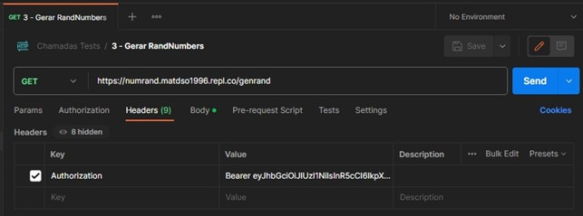
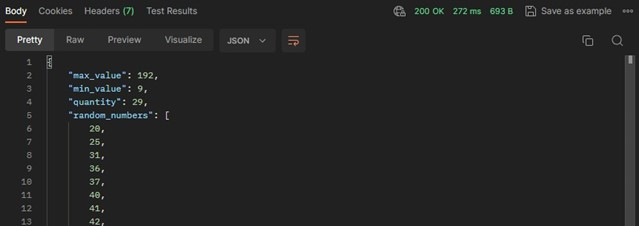
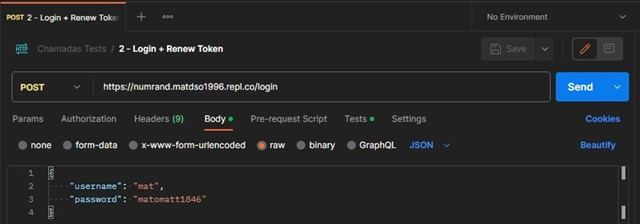
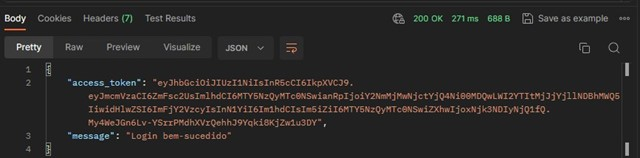

# **Resumo do Projeto**
O projeto consiste em uma aplicação que oferece funcionalidades para gerar números aleatórios, registrar usuários e permitir que os usuários façam login. Aqui está um resumo das principais características do projeto:

### **Gerar Números Aleatórios:**

A rota ***"/genrand"*** permite a geração de números aleatórios. Os parâmetros incluem valor mínimo, valor máximo, quantidade de números a serem gerados e os próprios números aleatórios. Os números gerados são fornecidos como parte da resposta.

### **Registrar o Usuário:**

A rota ***"/register"*** permite que os usuários se registrem na aplicação. Os usuários podem fornecer um nome de usuário e senha, em troca, recebem um token de acesso.

### **Login de Usuário:**

A rota ***"/login"*** permite que os usuários façam login na aplicação. Os usuários podem usar seu nome de usuário e senha para fazer login. Se as credenciais forem válidas, eles recebem um token de acesso. Essas funcionalidades tornam sua aplicação útil para gerar números aleatórios e gerenciar a autenticação de usuários, permitindo que eles acessem recursos protegidos por meio de tokens de acesso.

# **Desenvolvimento do Projeto**

## **Funcionalidades Implementadas**

Além das funcionalidades implementadas no projeto, destacamos as seguintes tecnologias e bibliotecas que desempenham papéis fundamentais em sua estrutura e funcionalidade:

***Flasgger:*** O ***“Flasgger”*** é uma biblioteca que simplifica a integração do ***“Swagger”*** com o ***“Flask”***. Essa integração é essencial para criar uma documentação interativa da API, incluindo descrições detalhadas de rotas, parâmetros, respostas e orientações sobre como utilizar a API. Isso torna a API mais acessível para desenvolvedores, facilitando a compreensão e a interação com a mesma.

***Flask-JWT-Extended:*** O ***“Flask-JWT-Extended”*** é uma extensão do ***“Flask”*** projetada para o gerenciamento de autenticação e tokens de acesso. Ele oferece uma solução eficaz para a criação de tokens de acesso e verificações de autenticação. Isso permite que os desenvolvedores protejam rotas e recursos específicos da API, garantindo a segurança e o controle de acesso. No nosso projeto, o ***“Flask-JWT-Extended”*** é usado para autenticar usuários durante o registro e o login, além de proteger a rota de geração de números aleatórios.

***Flask-SQLAlchemy:*** O ***“Flask-SQLAlchemy”*** é uma extensão que simplifica a integração do ***“Flask”*** com bancos de dados relacionais, como o ***“SQLite***”, que utilizamos neste projeto. Ele fornece uma camada de abstração que facilita a criação e a administração do banco de dados, armazenando as informações dos usuários registrados. Com o ***“Flask-SQLAlchemy”***, é possível interagir com o banco de dados de forma eficiente, criar tabelas e consultar registros com facilidade.

***JSON:*** O módulo ***“JSON”*** é uma parte essencial do projeto, usado para manipular dados no formato ***“JSON”***. Essa capacidade é valiosa na interação com o frontend da aplicação e na troca de informações entre a aplicação e os clientes. Com o módulo ***“JSON”***, a aplicação pode serializar e desserilizar dados de forma eficiente, garantindo uma comunicação eficaz.

***Random:*** O módulo ***“Random”*** desempenha um papel crucial na funcionalidade de geração de números aleatórios na rota ***"/genrand"***. Ele é responsável por gerar valores aleatórios com base nos parâmetros fornecidos pelos usuários, garantindo a diversidade e a aleatoriedade dos números gerados.

Essas tecnologias e bibliotecas desempenham um papel central no funcionamento da aplicação, na documentação eficaz da API e na segurança dos recursos por meio da autenticação e dos tokens de acesso. Elas contribuem para a criação de uma aplicação ***“Flask”*** sólida e versátil, pronta para atender às necessidades específicas do seu projeto.

## **Validação de Dados**
Para realizar a validação dos dados, montei uma ***“collection”*** via ***“Postman”***, fazendo a chamada individual e distribuindo as responsabilidades de cada endpoint. As informações devem seguir o padrão para que todas as requisições funcionem corretamente. Exemplo:

Para fazer o ***“Registro de Usuários”*** via API, primeiro devemos nos registrar na aplicação via endpoint, utilizando o método HTTP ***“POST”*** no link ***“[link_ip/register]”*** e ***“body”***:

Exemplo de envio do ***“body”***

Resultado status code ***“201 - Created”***:

Após recebermos a validação do ***“Registro bem-sucedido”*** e o ***“access\_token”***, podemos fazer uma nova requisição utilizando o ***“Token”*** no ***“Headers”*** e o mesmo ***“body”***, para obter ***“Gerar Números Aleatórios”*** utilizando o método HTTP ***“GET”*** no link ***“[link_ip/genrand]”*** e ***“Headers”***:

Devemos usar o ***“Token”*** no ***“Headers”*** da seguinte forma:
#### ***Bearer + access\_token***

Resultado ***“200 - OK”***, com todos os números no ***“response body”***:

(A imagem está cortada, mas todos os números foram sorteados, respeitando o intervalo, valores mínimos e máximos.)

Caso o token da aplicação venha expirar, precisamos fazer uma nova requisição, por isso foi criado o endpoint para ***“Login”***, utilizando o método HTTP ***“POST”*** no link ***“[link_ip/login]”*** e ***“body”***:

- ***“username”*** - Usuário enviado no registro;
- ***“password”*** - Senha enviada no registro;

Resultado ***“200 - OK”***, com um novo ***“access\_token”*** e a mensagem ***“response body”*** de ***“Login bem-sucedido”***:

# **Conclusão**
Durante o desenvolvimento do projeto, alguns desafios e problemas técnicos surgiram, mas foram enfrentados e resolvidos de maneira eficaz. Abaixo, discutirei os principais desafios e como eles foram superados:

- #### ***Integração com o Flask e Extensões:***

Um dos desafios iniciais foi configurar corretamente o ***“Flask”*** e suas extensões, como
#### ***“Flask-SQLAlchemy”***, ***“Flask-JWT-Extended”*** e ***“Flasgger”***.

***Solução:*** Para superar esse desafio, foram seguidas as documentações e tutoriais oficiais das extensões ***“Flask”***. Isso inclui a configuração do banco de dados, definição de modelos de dados e a integração de recursos de autenticação.

- #### ***Validação de Dados e Autenticação:***

Implementar a validação de dados, como garantir que os valores mínimos e máximos sejam aceitáveis, bem como a autenticação de usuários, apresentou desafios técnicos.

***Solução:*** A aplicação utiliza uma abordagem estruturada para a validação de dados e a autenticação, com uso extensivo de exceções para capturar e lidar com erros. A utilização do ***“Flask-JWT-Extended”*** simplifica a criação e validação de tokens de acesso, o que ajuda a garantir a autenticação adequada dos usuários.

- #### ***Documentação com o Swagger:***

Integrar o ***“Swagger”*** para a documentação da API foi um desafio em termos de configuração e definição de rotas e parâmetros de maneira adequada.

***Solução:*** Foi utilizada a biblioteca ***“Flasgger”***, que simplificou a documentação da API. Foram fornecidas descrições detalhadas de rotas, parâmetros e respostas, o que facilita a compreensão e a utilização da API por desenvolvedores.

- #### ***Teste e Validação:***

Testar a aplicação e garantir que todas as funcionalidades estivessem funcionando corretamente foi um desafio contínuo.

***Solução:*** Foram implementados testes unitários e de integração para cada funcionalidade, bem como testes de validação usando o ***“Postman”***. Isso ajudou a identificar e corrigir erros e garantir o funcionamento adequado da aplicação.

- #### ***Gerenciamento do Banco de Dados:***

Gerenciar o banco de dados ***“SQLite”***, criar tabelas e interagir com o banco de dados apresentou desafios relacionados à configuração e manutenção.

***Solução:*** O ***“Flask-SQLAlchemy”*** simplificou a interação com o banco de dados. A criação das tabelas e a manipulação de registros foram realizadas de maneira eficaz, com migrações de banco de dados geradas automaticamente.

Esses desafios foram superados com a combinação de pesquisa, consulta à documentação relevante e a aplicação de boas práticas de desenvolvimento. O resultado é uma aplicação funcional e segura que oferece funcionalidades importantes para geração de números aleatórios e gerenciamento de usuários.

